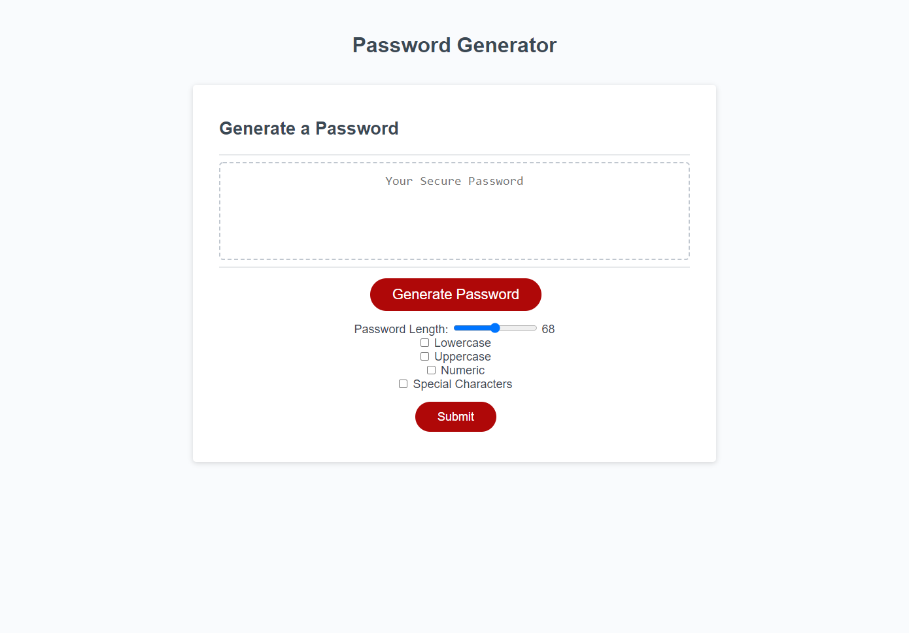

Password Generator
​
## Table of contents
​
- [Overview](#overview)
  - [The challenge](#the-challenge)
  - [User Story](#user-story)
  - [Acceptance Criteria](#acceptance-criteria)
  - [Screenshot](#screenshot)
  - [Links](#links)
- [My process](#my-process)
  - [Built with](#built-with)
  - [What I learned](#what-i-learned)
  - [Continued development](#continued-development)
  - [Useful resources](#useful-resources)
- [Author](#author)
​
​
## Overview
​
### The challenge
​To create and display a randomly generated password using a password generator with given inputs from the user

### User Story
​
```
AS AN employee with access to sensitive data
I WANT to randomly generate a password that meets certain criteria
SO THAT I can create a strong password that provides greater security 
```
​
### Acceptance Criteria
​
```
GIVEN I need a new, secure password
WHEN I click the button to generate a password
THEN I am presented with a series of prompts for password criteria
WHEN prompted for password criteria
THEN I select which criteria to include in the password
WHEN prompted for the length of the password
THEN I choose a length of at least 8 characters and no more than 128 characters
WHEN asked for character types to include in the password
THEN I confirm whether or not to include lowercase, uppercase, numeric, and/or special characters
WHEN I answer each prompt
THEN my input should be validated and at least one character type should be selected
WHEN all prompts are answered
THEN a password is generated that matches the selected criteria
WHEN the password is generated
THEN the password is either displayed in an alert or written to the page
```

### Screenshot
​

​
​
### Links
​
- Live Site URL: (https://ocampoad.github.io/Password_Generator/)
​
## My process
​
### Built with
​
- HTML elements ie. inputs, labels, checkboxes and a sliding range
- CSS pseudo-elements
​- Java 
​
### What I learned
​
In this challenge I learned how to implement Java Script. I was able to connect html and java together using 
```
document.querySelector("html element")
```
I was also able to learn if-else statements and for-loops to generate passwords and validating selection criterias. I am most proud of the generate and submit button using 

```
generateBtn.addEventListener("click", displaybtn);
passwordBtn.addEventListener("click", writePassword);
```

### Continued development
​
​I enjoy coding if-else and for-loops because it makes the function appear automatic and I would like to further learn the extent of how I can use these java script tools. I also think there are multitudes of functions to be made and we barely scratched the surface. 


### Useful resources
​
- [W3 Schools](https://www.w3schools.com/js/default.asp) - Great resource for showing java script examples
- [MDN](https://developer.mozilla.org/en-US/docs/Web) - Great resource for showing syntax and more details of html, css and java script elements
- [Stackoverflow](https://stackoverflow.com/) - Helpful community with questions and resources

​
## Author
​
- Website - [Adriane Ocampo](https://ocampoad.github.io/Adriane_Ocampo_Portfolio/)
​
​